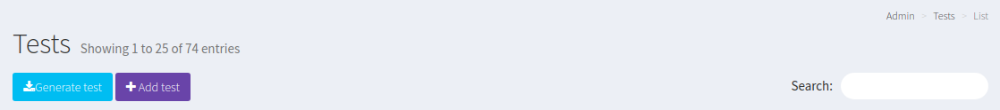
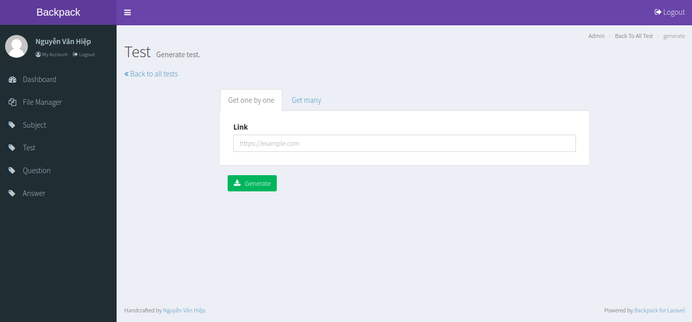

# getResource (for Backpack 3.x)

This package provides an easy to work for generating test, question and answer from link

## Requirements

you should have Backpack 3.x to use

## Installation

After clone project, you need to make database's name `laravel` and make `.env` file to complete set up

## Usage

go to `test` function, you can see:

go to `generate test`,  you have 2 options:

you can generate one by one test or generate many test with one link

enjoy

## Contributing
Pull requests are welcome. For major changes, please open an issue first to discuss what you would like to change.

Please make sure to update tests as appropriate.

## License
[MIT](https://choosealicense.com/licenses/mit/)